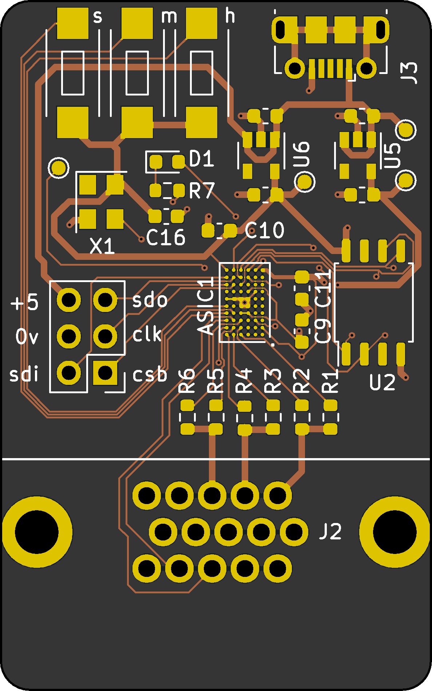
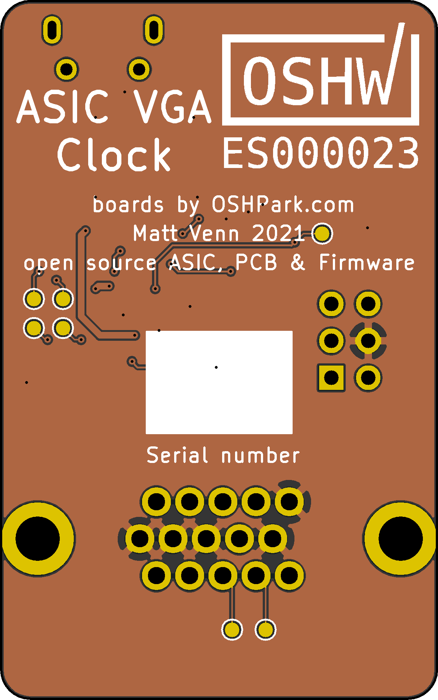

Matt Venn's VGA Clock on MPW1
=============================

PCB for my [VGA ASIC Clock](https://www.zerotoasiccourse.com/post/vga_clock/)

This PCB provides all the necessary components to make a functional clock:

 * Pads for mounting the ASIC
 * Decoupling
 * Voltage regulators for core (1.8) and IO (3.3)
 * Crystal oscillator
 * SOIC-8 footprint for dual SPI flash for the configuration firmware
 * 2x6 1.27mm header with housekeeping SPI, UART and 5V - the minimum connection needed for power and debug

# Setup

## Firmware

Needs to active project 2. See https://github.com/mattvenn/caravel-mph/blob/release/verilog/dv/caravel/user_proj_example/vga-clock/vga_clock.c for the simulation test.
Will need PLL setup to work on the ASIC.

For flashing, see https://github.com/efabless/ravenna/blob/master/firmware/blink/Makefile as a starting point. ravenna_hkspi.py may need some tweaks to work with Caravel.

## PLL config

Needs 31.5MHz for VGA signal.
Input oscillator is 10MHz.

Using https://github.com/kbeckmann/caravel-pll-calculator

    python3 caravel_pll.py  generate --clkin 10 --clkout 31.5 --allow-deviation

    PLL Parameters:

    clkin:    10.00 MHz
    clkout:   31.67 MHz
    clkout90: 31.67 MHz

    PLL Feedback Divider: 19
    PLL Output Divider 1: 6
    PLL Output Divider 2: 6

    Register 0x11: 0x36
    Register 0x12: 0x13

## Pinning

See the instantiation into the user project area here: https://github.com/mattvenn/multi-project-harness/blob/separate-macro/user_project_wrapper.v#L190
See the design repository here: https://github.com/mattvenn/vga-clock/tree/db029c38607c8d27f54b48bd8fd423cae3c4ed3d

    vga_clock proj_2 (
        .clk(proj2_clk),
        .reset_n(proj2_reset),
        .adj_hrs(proj2_io_in[8]),
        .adj_min(proj2_io_in[9]),
        .adj_sec(proj2_io_in[10]),
        .hsync(proj2_io_out[11]),
        .vsync(proj2_io_out[12]),
        .rrggbb(proj2_io_out[18:13])
        );

## Power

* Powergrid for the user project area has 4 buses. From outside to inside:  VSSA2, VDDA2, VSSA1, VDDA1, VSSD2, VCCD2, VSSD1, VCCD1.
    * VSSA2 user area 2 ground
    * VDDA2 3.3V user area 2 psu
    * VSSA1 user area 1 ground
    * VDDA1 3.3V user area 1 psu
    * VSSD2 user area 2 digital ground
    * VCCD2 1.8V user area 2 digital psu
    * VSSD1 user area 1 digital ground
    * VCCD1 1.8V user area 1 digital psu

* Power is provided to the module only by VCCD1 and VSSD1.

# Questions

* If I am only using VCCD1 and VSSD1, can connect these to the core supply and leave all others disconnected?
* What FLASH part has been tested to work?
* Buttons should be able to connect direct to VDDIO (no resistor needed)?

# Resources

* Based on https://github.com/samlittlewood/caravel_carrier
* Based on https://raw.githubusercontent.com/efabless/caravel/release/doc/caravel_datasheet.pdf

## License

* The PCB is licensed under the [MIT License](LICENSE)
* The ASIC is licensed under the [Apache2 License](https://github.com/mattvenn/vga-clock/blob/master/LICENSE-2.0.txt)
* The documentation is licensed under the [CC0 License](CC0_license)

# Open Source Hardware

This board (will be) is an OSHWA approved design: [ES000XXX](https://certification.oshwa.org/es000XXX.html)
